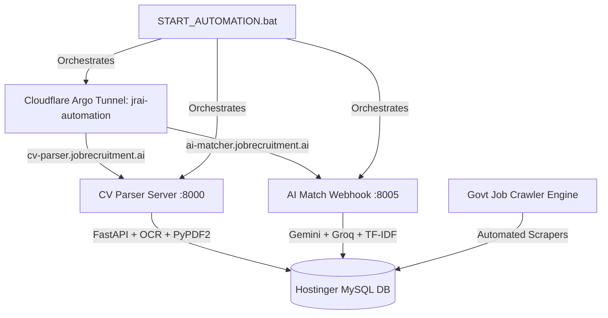

# JobRecruitmentAI Automation Services & Workers 🤖⚡

Comprehensive automation ecosystem for **[JobRecruitmentAI](https://jobrecruitment.ai)** (`jobrecruitment.ai`).

---

## 🌟 Core Automation Architecture



---

## 🚀 Key Modules & Services

### 1. 📄 CV Parser Engine (`automation/cv_parser_server.py`)
- **Port:** `8000` | **Public Hostname:** `cv-parser.jobrecruitment.ai`
- **Stack:** FastAPI, Uvicorn, Tesseract OCR, PyPDF2, pdfplumber, python-docx.
- **Capabilities:**
  - Automated Resume / CV parsing from PDF, DOCX, and images.
  - Multi-tier AI extraction with Gemini 2.5 Flash & Groq LLaMA 3.3 fallbacks.
  - High-precision extraction of Skills, Experience, Education, Contact Details, and CTC.

### 2. 🎯 AI Job Matching Webhook & Engine (`automation/ai_matching_engine.py` & `automation/ai_match_webhook.py`)
- **Port:** `8005` | **Public Hostname:** `ai-matcher.jobrecruitment.ai`
- **Capabilities:**
  - Real-time Candidate-to-Job & Job-to-Candidate compatibility scoring (0-100%).
  - Semantic and keyword skill graph alignment.
  - Webhook triggers for instant application match score updates.

### 3. 🏛️ Government Job Crawler Engine (`automation/gov-job-automation/`)
- **Capabilities:**
  - Automated scrapers for UPSC, SSC, RRB, State PSCs, Banking, and Defense recruitments.
  - AI extraction of official eligibility, pay scale, vacancies, age criteria, and PDF notification links.
  - Auto-injection into `jobrecruitment.ai` jobs repository.

### 4. 🌐 Cloudflare Argo Tunnel (`automation/cloudflare/`)
- **Tunnel Name:** `jrai-automation`
- Secure zero-trust tunnel routing live production requests from `jobrecruitment.ai` to local AI & OCR worker nodes.

### 5. 🛠️ Utilities & Root Automation Scripts (`automation/root-scripts/`)
- Database synchronization, health checkers, FAQ population, mojibake repair, and batch testing utilities.

---

## 💻 Service Management

### Start All Workers & Tunnels
Run as Administrator:
```cmd
E:\START_AUTOMATION.bat
```

### Stop All Services
```cmd
E:\STOP_AUTOMATION.bat
```

---

## 🛡️ Environment Configuration
Configure database connections and API keys in `E:\.env`:
```env
# Cloudflare
CF_ZONE=jobrecruitment.ai
CF_TUNNEL_NAME=jrai-automation

# AI APIs
GEMINI_API_KEY=...
GROQ_API_KEY=...

# Hostinger Database
DB_HOST=127.0.0.1
DB_USER=u390470426_jobret_ai
DB_PASS=...
DB_NAME=u390470426_jobret_ai
```

---
© 2026 **JobRecruitmentAI** (`jobrecruitment.ai`). All rights reserved.
